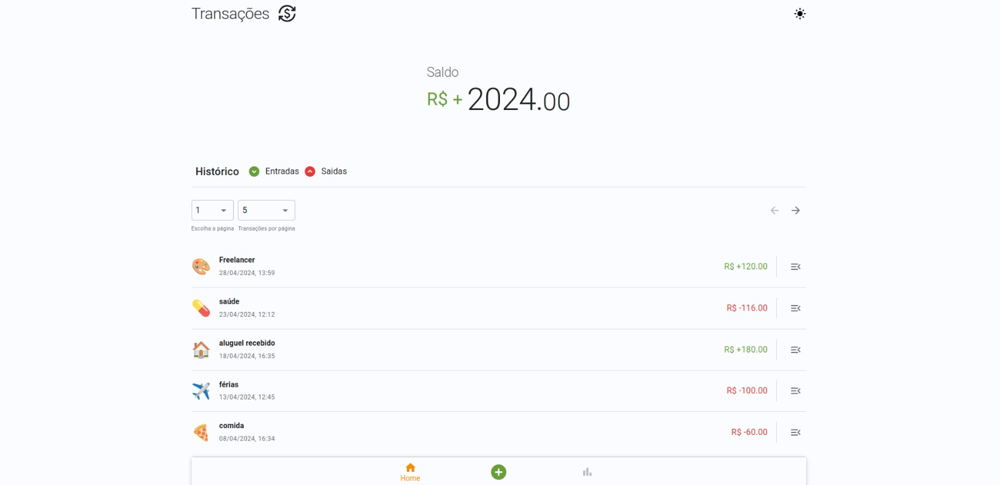
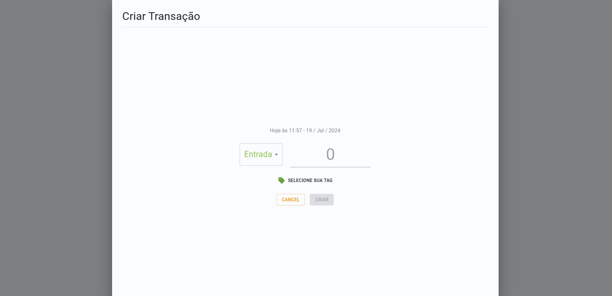
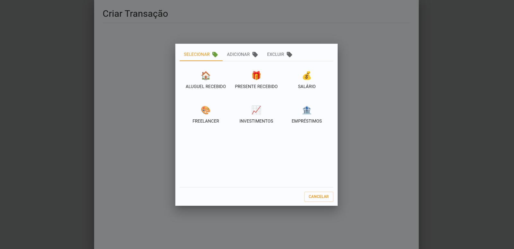

# Redux Transaction App

### Preview

## 🤔 About

The Redux Transaction App is a versatile and user-friendly application designed to help you manage your financial transactions efficiently. Built with modern technologies like React, Material-UI, Redux, and TypeScript, this app offers a seamless experience for tracking your income and expenses. Whether you're looking to monitor your spending habits, create custom tags for better organization, or switch between dark and light themes to suit your preference, the Redux Transaction App has got you covered. Its intuitive interface and robust feature set make it the perfect tool for personal finance management.

## 💻 Technologies Used

## 💡 Features

### Transactions:

- Create transaction.
- List transaction history.
- Update a transaction.
- Delete a transaction.
- Show balance.
- Filter history by incoming or outgoing.
- Pagination.

### Tags:

- List entry/exit tags (according to the type of transaction being created).
- Create customized tags.
- Delete tags.

### Themes:

- Switch between dark and light themes.

## 🚧 Notice

The Analytics page is currently under development. Soon, you will be able to view detailed charts and reports about your financial transactions. Stay tuned for future updates!

👾 Developed by [Jean Rafael Dresbach](https://www.linkedin.com/in/jean-rafael-dresbach/).
